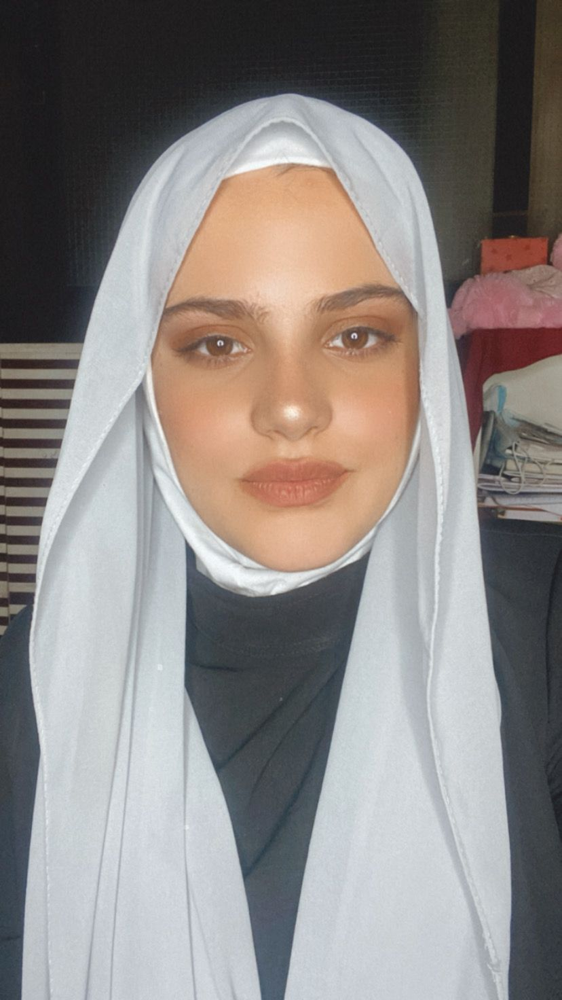
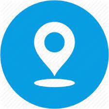

   
 
 # Malak wahyb


> ### Contact


   
   
 Adress:  akkar, lebanon 


  

   
  Email: malakwahyb537@gmail.com

 [malakGithub](https://github.com/malak-wahyb1)


> ### About me 
 ```
 I am a Fullstack developer, my sign is that I am committed to completing the task to the best of my ability.
 My goal is to put my previously gained and developed talents from my academic and social experiences into practice.
```

> ### Education
```
INSTUTE TECHNIQUE OF ORTHODOX 
2018 - 2019
License technical in IT

Rafic al hariri high school 
2015 - 2016
Bac2 SG 

```
> ### Work experiences

* life skills trainer 
06/2022- 10/2022
delivering life skills training for youth between 18 and 24 years old. 

* co-de trainer 
01/2022 - 10/2022
delivering coding for youth between 8 and 14 years old and training of trainer


> ### Trainings

* TOT life skills 
05/2022 - 06/2022

* TOT  
11/2021 - 02/2022

* Life skills 
11/2021 - 02/2022 


> ### Skills

* communication skills 
* presentation skills
* leadership skills
* time mangement

> ### languages

* English
* French
* arabic


     
   


  

